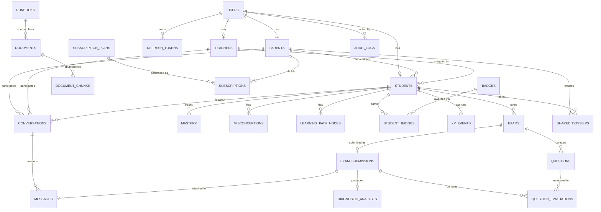

# Database

MySQL 8 (InnoDB, utf8mb4). Authoritative DDL: `sql/schema.sql`. ORM models
mirroring it 1:1: `model/models.py`. Seed data: `seed_db.py` +
`sql/seed_runbooks.json`.

## Conventions
- Every table uses a `CHAR(36)` UUID primary key (`VARCHAR(60)` for
  badges/subscription plans, which use human-readable slugs as ids).
- `users` is the identity table for every role (STUDENT/PARENT/TEACHER/
  ADMIN/SUPER_ADMIN); `parents`, `students`, `teachers` are 1:1 profile
  extension tables keyed on `users.id`.
- JSON columns (`core_concepts`, `k_graph_insights`, `answers`, etc.) hold
  structured data that doesn't need to be queried/joined on individually —
  chosen over normalized tables where the frontend already treats the
  field as an opaque array/object (matching `types.ts`).
- Historical data is never overwritten: `mastery` and `exam_submissions`
  accumulate rows/counters rather than replacing them, per master prompt §19.

## Entity-relationship diagram

## Notable indexes
- `runbooks (board, class_grade, subject)` — the hot path for exam
  generation's RAG retrieval filter.
- `exam_submissions (student_id)`, `exams (student_id, created_at)` —
  dashboard/overview queries.
- `mastery (student_id, topic)` **unique** — one row per student/topic,
  upserted on every submission rather than duplicated.
- `messages (conversation_id)` — PTC thread loading.

## Things deliberately normalized differently than the frontend's flat model
- The frontend's `Board`/`ClassGrade`/`Subject` are TypeScript string
  unions with no backing table; the backend stores them as plain
  `VARCHAR` columns rather than a `boards`/`grades`/`subjects` taxonomy —
  see docs/FRONTEND_BACKEND_MAPPING.md §5 for why (the frontend never
  needed the hierarchy to be queryable, only enumerable, which
  `utils/constants.py` already provides).
